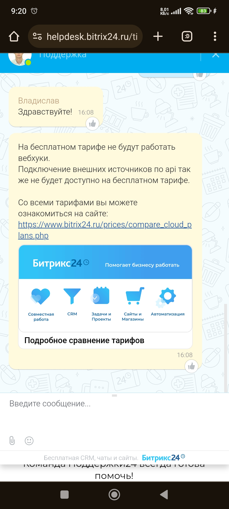

#1. Необходимо написать программу, которая будет получать данные контакта (ID, Имя)
из Битрикс24 по Webhook проверять имя контакта на наличие его в БД (PostgreSQL)
Женские имена таблица names_woman
Мужские имена таблица names_man
Далее, если нашел имя в БД мужчин ставить пол Мужчина, если нашел имя в БД женщин
ставить Женщина
Далее передавать данные по гендеру обратно в контакт по ID

#2. Необходимо создать сайт с админ панелью и 2-мя кабинетами на Flask или Django.
Сайт может быть не оформлен красиво. Структура на выбор. Можно взять за основу сайт
kwork.ru. На сайте помимо админки должны быть два кабинета заказчика и исполнителя.
Минимальный набор полей в профилях (имя, контактные данные, опыт). БД PostgreSQL

Решение

1. Поскольку webhook в bitrix24 доступен только в платной тарификации, то реализован +/- схожий сервис

2. Рализовано на Django. Полный UX/UI как с сайтом kwork.ru не реализован, но раелизован схожий функционал.

#1. We need to write a program that will receive contact data (ID, Name)
from Bitrix24 via Webhook to check the contact's name for its presence in the database (PostgreSQL).
Female names table names_woman
Male names table names_man
Further, if you found the name in the database of men, put the gender Male, if you found the name in the database of women
put Woman
Then pass the data on gender back to the contact by ID

#2. It is necessary to create a site with admin panel and 2 offices on Flask or Django.
The site may not be designed beautifully. Structure to choose from. You can take as a basis site
kwork.ru. On the site in addition to the admin panel should be two offices of the customer and the performer.
A minimum set of fields in profiles (name, contact information, experience). PostgreSQL database

Solution

1. Since webhook in bitrix24 is available only in paid billing, we implemented +/- similar service

2. Rationalized in Django. Full UX/UI as with the site kwork.ru is not implemented, but similar functionality.